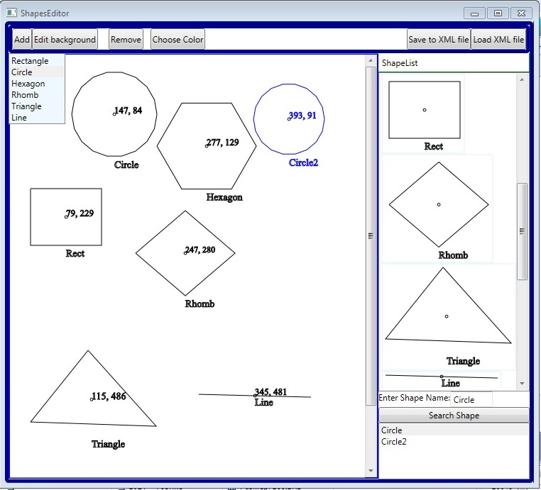

##### Description:
- ShapesHandler Project is WPF Shapes Editor, with multifunctional features. 
- It allows to create the line-combining shapes (Rectangle, Rhomb, Hexagon, Circle, Triangle, Line). 
- These shapes are accompanied with their centre-point, and with their coordinates and name labels.
##### Drawing:
- The first four shapes are created with mouse left-button click, by entering the name and the geometric parameters (size, radius, diagonales).  
Triangle and line are created by mouse clicks (locating the points), and entering the name.
- *Add button* allows to choose the shape type to be drawn.
##### Editing:
- To select the created shape in view, click it one-time with mouse right button (the original colours turns from black to grey).
- - To move selected shape, hold right button pressed and move it along and around the drawing canvas and release the hold where it is needed.
- To remove the shape, first select it for this feature, that is double click the shape with mouse-right button (the figure turns red-brown). 
Then you can click remove button, and delete this figure, or you can double-click this figure again by right-button and return it from special selection state, and restore original colour of the shape. 
- After the double clicking by right button the shape (turning red for deletion), you can also choose new color for the figure by appropriate button in header menu, and then return by 2 right clicks to unselected state. 
- To pan the drawing field (canvas), double-click it with mouse righ-button, where it is free of shapes. 
- To select image background for view use "Edit background" button in the menu. 
In case of cancelling of this action, default colour background is applied to background.
- As the shapes are named, it is desired to have unique names in drawing canvas. The names should be started with alphabetical characters, without digit or punctuation as the first letter. 
- Every created shape is copied and stored in righ-pane listbox, so it can be dragged to canvas by mouse left button.
- There is also search functionality in righ-bottom corner of window, where figure can be searched by its name or part of it. 
You can select found shapes (names) among results and appropriate figure is turned green. 
- To save the view (User Control/Canvas) with shapes to xml (xaml) file, use appropriate button in header menu. 
- To load it back from xml file, use another neighboring button. 
In the case of non-unique names within shapes, it would not be loaded. 
But such names can be manually changes in xml files, to be able to load to the app.
###### Used environment: .NET 4.5, VS 2012
###### Examples:

